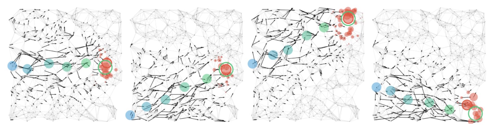

# Gretel

Implementation of the paper [Extrapolating paths with graph neural networks TODO link](), 

by Jean-Baptiste Cordonnier and Andreas Loukas.


*Illustration by Arthur Rackham, 1909*


## Introduction

We consider the problem of path inference: given a path prefix, i.e., a partially observed sequence of nodes in a graph, we want to predict which nodes are in the missing suffix. In particular, we focus on natural paths occurring as a by-product of the interaction of an agent with a network -- a driver on the transportation network, an information seeker in Wikipedia, or a client in an online shop. Our interest in path inference is due to the realization that, in contrast to shortest-path problems, natural paths are usually not optimal in any graph-theoretic sense, but might still follow predictable patterns.

Our main contribution is a graph neural network called Gretel. Conditioned on a path prefix, this network can efficiently extrapolate path suffixes, evaluate path likelihood, and sample from the future path distribution. Our experiments with GPS traces on a road network and user-navigation paths in Wikipedia confirm that Gretel is able to adapt to graphs with very different properties, while also comparing favorably to previous solutions.



## Reproductibility

Install a conda environment and the dependencies with `./create_env.sh env_name`.

You can format your own data following the format defined in `main.py:load_data()` documentation or you can download our dataset from [here](https://drive.switch.ch/index.php/s/Ubblvuoxl1EuiLQ).

### Directory structure

```
.
├── gretel
|   ├── config
|        ├── wiki_nll
|        └── ...
└── workspace
|   ├── chkpt
|        ├── trained_model1
|        └── ...
|   ├── mesh
|   ├── planar
|   ├── gps
|   ├── gps-rnn
|   └── wikispeedia
```

Run

```bash
python main.py config/wiki...
```

## Reference

```
TODO arxiv Bibtex
```
